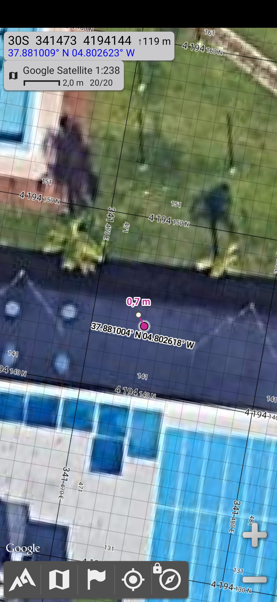

# TinyTrackGPS+
[](README.md)
[]()&nbsp;

A simple, fast and highly accurate portable GPS track logger with position estimation for greater accuracy, record track on microSD card and featured by Assisted GPS (A-GPS), 10DOF sensors and World Real Time Clock (RTC) with  automatic Summer and Standard Time change.

&nbsp;

&nbsp;

## Features
TinyTrackGPS+ is the next generation concept of the old [TinyTrackGPS](https://rafaelreyescarmona.github.io/TinyTrackGPS/), whith more features but the same intention, to be a simple use portable GPS track log. You can find some similar projects like [Arduino GPS Tracker](https://makersportal.com/blog/portable-gps-tracker-with-arduino) (or [Github](https://github.com/makerportal/arduino-gps-tracker)) of 
[Maker Portal](https://makersportal.com/), which uses similar hardware.

TinyTrackGPS+ uses the information from GNSS and 10 DOF sensors to estimate the position and save that information into a log file in the microSD card.

This program is written in C/C++ for CPU-ARM® Cortex®-M0+(SAMD21G18), SAMD21, and compatible microcontrollers.

XIAO SAMD21 powered by (SAMD21G18)[https://files.seeedstudio.com/wiki/Seeeduino-XIAO/res/ATSAMD21G18A-MU-Datasheet.pdf] chip is an ultra-small, high-performance universal development board. It supports Arduino / Micropython / CircuitPython development. TinyTrackGPS+ is developed on PlatformIO with Arduino enviroment.


[](LICENSE)

When power on the first display shows date and time UTC, version, logo, charge of battery and a waiting animation similar to hourglass. Device is waiting for GPS signal. When GPS signal is ready, it is showing the main display.

Before the first display, the GNSS module is configured and A-GPS info is sent into it.

When GPS signal fixed, TinyTrackGPS+ adjust the date and time to the configured timezone into config file. Timezone is calculated based on the coordinates where the device is turn on.


<center>QGIS visualization data.</center>&nbsp;


TinyTrackGPS+ features:
* Show estimated GPS coordenates in Grades and UTM (WG86) formats, based on GPS info and other movements' sensors as gyroscope, accelerometer, magnetometer and barometer.
* Save a tracklog in CSV format.
* Save time in tracklog on local time.
* Show battery charge.
* microSD card can be extracted and connected without powerdown or reset.
* Without memory card, it works as a simple GPS device.
### Main Display Parts

&nbsp;

## List of componets

This project use components list above:

  * Seeeduino XIAO, SAMD21 microcontroller.
  * ATGM336H dual GPS + BDS GNSS module.
  * MicroSD module and card.
  * OLED 0.96" I2C (SSD1306) 128x64 px.
  * MPU6050 gyroscope and accelerometer.
  * QMC5883L magnetometer.
  * BMP180 barometer.
  * DS3231 RTC.

  Additional:
  * Lipo 3,7V 700mAh 603035 with protect.
  * MicroUsb charge module.

Current on this configuration is 60mA at 5,082VDC average, so 304.92mW. It will be an autonomy of 8,5h.

&nbsp;

### Seeeduino XIAO
Seeed Studio XIAO SAMD21 carries the powerful CPU-ARM® Cortex®-M0+(SAMD21G18) running at up to 48Hz. In addition to the powerful CPU, it has 256KB Flash and 32KB SRAM on board and supports the USB Type-C interface which can supply power and download code.

	
|**Item**|**Descripion**|
|:-------:|:--------:|
|CPU      | ARM Cortex-M0+ CPU(SAMD21G18) running at up to 48MHz Storage 256KB Flash,32KB SRAM|
|I/O PINs | 14 GPIO PINs,11 analog PINs, 11 digital PINs,10 PWM interfaces (d1-d10),  1 DAC output Pin |
|Interface| 1 I2C interface,1 UART interface, 1 SPI interface, 1 UART interface, USB Type-C interface |
|LEDS     | Serial communication indicator (T/R), Blink light (L) through pin multiplexing. The colors of LEDs(Power,L,RX,TX) are green, yellow, blue and blue.|

For more information see at :https://www.seeedstudio.com/Seeeduino-XIAO-Arduino-Microcontroller-SAMD21-Cortex-M0+-p-4426.html

### ATGM336H
ATGM366H-5N-31 is a GPS module that works with UART (TX and RX) signals. Based on the fourth generation of low-power GNSS SOC Chips – AT6558. Works with GPS, BDS and operates with a range of 5.0v to 3.3v. All on an small size module.

Specifications:
  * Voltage range (VCC): 3.3-5V DC
  * I/O Voltage: 3.3V
  * Standard baud rate: 9600, but can to be changed.
  * Works with GPS, BDS
  * LED indication when GPS has a fix (blinking LED)
  * Dimensions PCB (LxWxH): 16.2x13.8x5.3mm (without header pins)
  * A-GPS support.
  * Contains 32 tracking channels that can receive GNSS signals from six satellite navigation systems simultaneously and enables joint positioning, navigation and timing.
  * Suitable for car navigation, handheld positioning, wearable devices
  * Can replace Ublox MAX, NEO-6M, 7M, 8M directly.
  * Output standard NMEA0183 signal from serial.
  * High sensitivity: Cold start capture sensitivity: -148dBm. Tracking sensitivity: -162dBm
  * Positioning accuracy: 2.5 meters (CEP50, open area)
  * First positioning time: 32 seconds
  * Low power consumption: continuous operation <25mA (@ 3.3V)
  * Built-in antenna detection and antenna short-circuit protection

Pinout:
  * VCC: Input voltage
  * GND: Ground/min
  * TX: UART connection
  * RX: UART connection
  * PPS: Precise Pulse Second; Gives a pulse every second (linked to the UTC time)

#### AGPS
  * Example to write a Assist GPS data downloaded from de u-blox server to out GPS Module.: https://github.com/gokuhs/ublox-agps
  * https://forum.espruino.com/conversations/371360/

This is my function to send agps data to AT6558: 
```C++
// dowload agps data from https://www.espruino.com/agps/casic.base64
// 6 hours valid data.
bool AGPS() {
  char AGPS[]="casic.base64";
  if (card.exists(AGPS)) {
    if(file.open(AGPS,O_READ)){
      uint16_t date_AGPS, time_AGPS;
      file.getModifyDateTime(&date_AGPS, &time_AGPS);
      time32_t time = (clock_rtc.now().unixtime() - (SECS_PER_HOUR * 6));
      uint16_t date = (year(time)-1980) << 9 | month(time) << 5 | day(time);
      if (date <= date_AGPS) {
        String data = file.readString();
        gpsPort.print(data);
      }
      file.close();
      return (date <= date_AGPS) ? true : false;
    }
  }
  return false;
}
```
The file `casic.base64` content is similar to this: 
```
QUdOU1MgZGF0YSBmcm9tIENBU0lDLgpEYXRhTGVuZ3RoOiAyNjgwLgpMaW1pdGF0aW9uOiAxLzEw
MDAuCrrOSAAIB1j1K93tKQ2hyjSXBhAhUidRUdx0XoNVKET7hmEpq///2CvL/5z/PwUsK/v/CgCX
/9xQ1wDcUAAA0/4FAOj/AApXAAEAAQMAAPjqX8G6zkgACAfBrk3VLQs8oViz3wjM16vLcLnC9gIR
aifOFoJdAKP//6MyKwFtAYkGpSiJAZH/1f/cUNcA3FAAAPSS7P8jAADaGQAAAAIDAADKXaOxus5I
AAgHsT+2zDtbDaF86noCu4SlKbD32kWR9OUnRZOAi2mq//8fLLT+0vUgDoEgvPSm/+b/3FDXANxQ
AACxY/b/aQAABGMAAQADAwAAqn90oLrOSAAIB19VxsvmWg2hGWM3AS8fsIYlkxW7q7c2J9jxiLd+
q///oC4HA2b8LRN/GQL8wv/r/9xQ1wDcUAAAR6MBAFcAAPZqAwAABAMAAAarlJ66zkgACAcfgoNJ
uWQNoQIuDAP1gLAubfYD3xq1XifdY5uJ+qb//0Uw2f3w9VULhSJw9OH/RwDcUNcA3FAAAHDK+//z
/wDoVgAAAAUDAACGBA+aus5IAAgHCSeomr9eDaFucmsBv+Cn4VcuQXx9PU0ociEwYVKo//+ULaEA
fAGtBQQrYwHu/ysA3FDXANxQAAC0QBMA+f8ACBgAAAAGAwAAWk5YPLrOSAAIB+k8CqrD7Q2hY2Df
CPhFmKY14O5aTFW3JsU/6OCgqf//hzS+AHr/Ig54Hu//3v9H/9xQ1wDcUAAAw5IFAKz/AOhgAAAA
BwMAABp6HFu6zkgACAdc7p3/Rp8NoRWZVASsoO0Kx8kFztuBDifsMgY1Paj//y4xlQEWCVENhh+8
CjcAu//bUNcA21AAAJjv+//w/wALQwACAAgDAAAA3UMGus5IAAgHGskuwproDKHjlTUBBIFeT8xz
qd8cB/EmvrE5tXip///dMAQDDfw2E9oYj/vb/xwA21DXANtQAADICPv/SwAAAgoAAAAJAwAAfJJl
i7rOSAAIBykVrBq+iA2h6PZYBPvM9pwNTm8fuTDjJ0T3ZIt6qP//Uy3O/ev2ogw3Iiz1+f8iANxQ
1wDcUAAAtb7+//L/AAUtAAAACgMAAJoqYDy6zkgACAcCmd1hlv4NofU1bQCgi5SL5ASwtlpKVSdI
ut9iwqT//0EzTQAyAdYELyoAASMA9P/cUNcA3FAAAKAm+f+D/wDt5AAAAAsDAABMMsPKus5IAAgH
NfrlR1TLDKHIQYIEtDsDOCNBPzxX2lknLG5PDump//9YL3v9MwO7ETkb1AO6/5T/21DXANtQAAC8
i/P/1/8A5QMAAAAMAwAAsvTTlrrOSAAIB3bUmmRXWg2h13uRAxfR+SSgorC+71F/Jw5ywbvQrP//
8CyGAuT7ehLnGj37agDq/9xQ1wDcUAAANjARAC4AAOh2AAAADQMAADSpPdC6zkgACAcMCBGawmwN
oRlrnwGRz82E2H25PCY0rCbE07wMw6j//2gztfy3A08RqRqDBAAAEwDcUNcA3FAAAJA5AgBvAADv
jgEAAA4DAABgECo7us5IAAgHij+aTqbSDaFuL6EHb/HJMLTxYafs6volNXNnsHOq//+/NOYC+fnU
Eb0Y6PhwAN//3FDXANxQAADMZAEAHgAA6SkAAgAPAwAAXH88pLrOSAAIBwLoq/DV0wyhhILRBoR6
JSA8WQzzNppWJ7vZDQ8SqP//di/B/UsE+hFfG08EDQBmANxQ1wDcUAAAs63v/x4AAOogAAAAEAMA
AEzQX+i6zkgACAfxeGCgozEOoXk66AYpOajG1FH9y7B3sCeW7KY4gqj///Mt8gCKC1gOviDEDHL/
bgDcUNcA3FAAAEl2FwAMAADoRQABABEDAAAq8shHus5IAAgHfUNyHtVjDaFcMKUBJnlsf06Szntb
cK0nfLSRYYGn//+uMKoAsQEABqwpwgHT/wcA3FDXANxQAACT1Pb/d/8A7s4CAgASAwAAQofsQ7rO
SAAIB+DbC4RgAg2h5PjTBKLK0125wfIkjXmmJ/urdzr0qP//pC4AAY0JiQ2nIDgLOACj/9xQ1wDc
UAAAXIcKAC0AAN9hAAAAEwMAAAi4Hw+6zkgACAfSWpJY72cMoTd8EwK2GreKjrBvlaVYqCZDlJ+E
WaX///408f3S9UkJYSMX9Nn/yv/cUNcA3FAAABMmDgDu/wDuUAAAABQDAADstSy4us5IAAgHNM3f
1CHwDKHKmaEMxSUa4aMbfswcvy4n9JVOXemh///NNBgDrQDPBqIo7ABd/2r/21DXANtQAACjCAUA
/v8A6gMAAAAVAwAAsJrHsLrOSAAIB5fdGEU/EA2hVfNXB8XehrZ+P6bGDBk1J2sXg7nVqf//EzC3
ATr9xBFHG678VAC9ANxQ1wDcUAAAYPMPADcAAO4nAAA/FgMAAHa7OZG6zkgACAcJCPYgG0oNoV3C
ngGem9yByBKTWwV1sCfuXkmKZ6n//0Qux/6k9vIL6CIl9e//JgBLUdcAS1EAAC/iAAAdAADuGQAC
ABcDAABaEPRIus5IAAgHcURqZy0qDaGaDhsHyKFlJE77RIECdAsmv+o23Qqp//9oN+UB+//lDX0d
/P8eALz/3FDXANxQAABUbfn/iP8ABh8AAAAYAwAAKonc1brOSAAIB4mHhlYK1g2hd9WtBV3c2CpC
qc81/JDZJkOT9Qrupv//HDOA/EgCBRFCG9gCm/8PANxQ1wDcUAAA75UOABcAAAwkAAAAGQMAAFoP
FbS6zkgACAd/KJQfvYkNoc80CwQknu0Se4rDGKsTESYmr7EIpqX//2Q3x/wOAs0QeBo/Avj/UwDc
UNcA3FAAABDgBwD7/wAPHgAAABoDAABGUTBGus5IAAgHK+/lDkRfDaFazOwFS7IUHre6Ps9HHGsn
hJL5NTGp///eLi8BKAkBDaUgDwqPABkA3FDXANxQAAC8AAEAuv8ABAwAAgAbAwAAnt7TJLrOSAAI
BzeMiwQUag2hPo1bAD/IsEU8u/obtmMrJ05rYt/OqP//fTKqAFgAEA6MH3AADgDl/9xQ1wDcUAAA
IKACABcAAOseAgAAHAMAALYYHxC6zkgACAcloDQ9JyUOoTYUTgFauX1hXf5I0pHtxyeByjk52an/
/2MtOwEjCQkPqB8PC/v/9f/cUNcA3FAAAPRR7P/0/wDqQAACAB0DAACSQHGBus5IAAgH0Re9r8+u
DKG2wVQDN6LFlmiKXFbAQhwmp3go4fil//8VOQQAGgD6DeQdPgDL//H/3FDXANxQAAByHe//FAAA
CBQAAAAeAwAA6i+CZrrOSAAIB8nGWu26rxGhjANqBY/onBVu26w2FBfiJt2yuOGKp///8zMH/9QA
bA7zHpQAuP8hANxQ1wDcUAAAl+X4//n/AOMyAAAAHwMAANqNveG6zkgACAeyb5QhQv0NoYiBiQM5
8DqmWZyA6GS7Fic/8sK1YKj///wwBQI7/I4RWxvS+xUAOQDcUNcA3FAAAMQg8P+x/wABXwAAACAD
AACs3zBKus4UAAgFnBlm1/////8CAAAAEhJj14kHAwBMM9Szus4QAAgGUAz8+RMD/v46Cf76AwAA
ALAYAPo=
```
Visit the manufacturer page for more information about AT6558 GNSS chip:
https://www-icofchina-com.translate.goog/xiazai/?_x_tr_sl=auto&_x_tr_tl=en&_x_tr_hl=en-GB#

In this web you can download [GnssToolkitv3](https://www-icofchina-com.translate.goog/d/file/xiazai/2020-09-22/26ac3f347aca9fc6c3a23db296b0dec0.zip?_x_tr_sl=auto&_x_tr_tl=en&_x_tr_hl=en-GB) and [AGPS.zip (example code)](https://www-icofchina-com.translate.goog/d/file/xiazai/2020-09-22/1108f8726fa725d78a3d2aa928b221d4.zip?_x_tr_sl=auto&_x_tr_tl=en&_x_tr_hl=en-GB).

Bangle.js 2 has AT6558 GNSS chip, so the agps app could give some information about how to do it: 
* Bangle Apps: https://banglejs.com/apps/
* Bangle agps app (GitHub): https://github.com/espruino/BangleApps/tree/master/apps/assistedgps

### MPU6050 gyroscope and accelerometer
The MPU6050 is a 6 degrees of freedom (DoF) inertial measurement unit (IMU) as it combines a 3-axis accelerometer and a 3-axis gyroscope on the same silicon die, together with an onboard Digital Motion Processor™ (DMP™). The device can access external magnetometers or other sensors through an auxiliary master I²C bus, allowing the devices to gather a full set of sensor data without intervention from the system processor. Widely used for navigation, direction finding, stabilisation, etc.

For precision tracking of both fast and slow motions, the parts feature a user-programmable gyro full-scale range of ±250, ±500, ±1000, and ±2000 °/sec (dps), and a user-programmable accelerometer full-scale range of ±2g, ±4g, ±8g, and ±16g. Additional features include an embedded temperature sensor and an on-chip oscillator with ±1% variation over the operating temperature range.

Features:
  * Digital-output of 6-axis MotionFusion data. 9-axis fused data from Motion Processing Library
  * Tri-Axis angular rate sensor (gyro) with a sensitivity up to 131 LSBs/dps and a full-scale range of ±250, ±500, ±1000, and ±2000dps
  * Tri-Axis accelerometer with a programmable full scale range of ±2g, ±4g, ±8g and ±16g
  * Reduced settling effects and sensor drift by elimination of board-level cross-axis alignment errors between accelerometers and gyroscopes
  * Digital Motion Processing™ (DMP™) engine offloads complex MotionFusion, sensor timing synchronization and gesture detection
  * MotionApps™ Platform support for Android, Linux, and Windows
  * Embedded algorithms for run-time bias and compass calibration in library. No user intervention required
  * Digital-output temperature sensor
  * Digital input on FSYNC pin to support video Electronic Image Stabilization and GPS
  * Programmable interrupt supports gesture recognition, panning, zooming, scrolling, and shake detection
  * VDD Supply voltage range of 2.375V–3.46V; VLOGIC (MPU-6050) at 1.8V±5% or VDD
  * Gyro operating current: 3.6mA (full power, gyro at all rates)
  * Gyro + Accel operating current: 3.8mA (full power, gyro at all rates, accel at 1kHz sample rate)
  * Accel low power mode operating currents: 10µA at 1Hz, 20µA at 5Hz, 70µA at 20Hz, 140µA at 40Hz
  * Full Chip Idle Mode Supply Current: 5µA
  * 400kHz Fast Mode I²C or up to 20MHz SPI (MPU-6000 only) serial host interfaces
  * User self test
  * 10,000g shock tolerant
  * Smallest and thinnest package for portable devices (4x4x0.9mm QFN)
  * RoHS and Green compliant

Resources:
  * https://naylampmechatronics.com/blog/45_tutorial-mpu6050-acelerometro-y-giroscopio.html
  * https://invensense.tdk.com/products/motion-tracking/6-axis/mpu-6050/

### QMC5883L magnetometer
The QMC5883L is a multi-chip three-axis magnetic sensor. The QMC5883L has integrated magnetic sensors with signal condition ASIC, targeted for high precision applications such as compassing, navigation and gaming in drone, robot, mobile and personal hand-held devices.

The QMC5883L is based on the state-of-the-art, high resolution, magneto-resistive technology licensed from Honeywell AMR technology. Along with custom-designed 16-bit ADC ASIC, it offers the advantages of low noise, high accuracy, low power consumption, offset cancellation and temperature compensation. QMC5883L enables 1° to 2° compass heading accuracy. The I²C serial bus allows for easy interface with the device and other componets.

Features:
  * 3-Axis Magneto-Resistive Sensors in a 3x3x0.9 mm3 Land Grid Array Package (LGA), guaranteed to operate over an extended temperature range of -40 °C to +85 °C. 
  * 16 Bit ADC With Low Noise AMR Sensors Achieves 2 Milli-Gauss Field Resolution 
  * Enables 1° To 2° Degree Compass Heading Accuracy, allows for Navigation and LBS Applications 
  * Wide Magnetic Field Range (±8 Gauss)
  * Temperature Compensated Data Output and Temperature Output 
  * I²C Interface with Standard and Fast Modes. High-Speed Interfaces for Fast Data Communications. 
Maximum 200Hz Data Output Rate. The I²C address is “0x0D”.
  * Wide Range Operation Voltage (2.16V To 3.6V) and Low Power Consumption (75uA). Compatible with Battery Powered Applications 
  * Compassing Heading, Hard Iron, Soft Iron, and Auto Calibration Libraries Available.

  Resources:
  * https://qstcorp.com/upload/pdf/202202/13-52-04%20QMC5883L%20Datasheet%20Rev.%20A(1).pdf

### BMP180 barometer
The BMP180 is the function compatible successor of the BMP085, a new generation of high precision digital pressure sensors for consumer applications.

The ultra-low power, low voltage electronics of the BMP180 is optimized for use in mobile phones, PDAs, GPS navigation devices and outdoor equipment. With a low altitude noise of merely 0.25m at fast conversion time, the BMP180 offers superior performance. The I2C interface allows for easy system integration with a microcontroller. 

Features: 
  * Pressure range: 300 ... 1100hPa (+9000m ... -500m relating to sea level)
  * Supply voltage: 1.8 ... 3.6V (VDD), 1.62V ... 3.6V (VDDIO)
  * Low power: 5µA at 1 sample / sec. in standard mode
  * Low noise: 0.06hPa (0.5m) in ultra low power mode, 0.02hPa (0.17m) ultra high resolution mode.
  * Temperature measurement included.
  * I²C Interface
  * Fully calibrated
  * Pb-free, halogen-free and RoHS compliant,
  * MSL 1
  * Typical applications: 
    - Enhancement of GPS navigation (dead-reckoning, slope detection, etc.)
    - In- and out-door navigation
    - Leisure and sports
    - Weather forecast
    - Vertical velocity indication (rise/sink speed)

Resources: 
  * https://media.digikey.com/pdf/Data%20Sheets/Bosch/BMP180.pdf
### DS3231 RTC
The DS3231 is a low-cost, extremely accurate I²C real-time clock (RTC) with an integrated temperature-compensated crystal oscillator (TCXO) and crystal. The device incorporates a battery input, and maintains accurate timekeeping when main power to the device is interrupted. The integration of the crystal resonator enhances the long-term accuracy of the device.

The RTC maintains seconds, minutes, hours, day, date, month, and year information. The date at the end of the month is automatically adjusted for months with fewer than 31 days, including corrections for leap year. The clock operates in either the 24-hour or 12-hour format with an active-low AM/PM indicator. Two programmable time-of-day alarms and a programmable square-wave output are provided. Address and data are transferred serially through an I²C bidirectional bus.

A precision temperature-compensated voltage reference and comparator circuit monitors the status of VCC to detect power failures, to provide a reset output, and to automatically switch to the backup supply when necessary. Additionally, the active-low RST pin is monitored as a pushbutton input for generating a µP reset.

Features:
  * Highly Accurate RTC Completely Manages All Timekeeping Functions
    - Real-Time Clock Counts Seconds, Minutes, Hours, Date of the Month, Month, Day of the Week, and Year, with Leap-Year Compensation Valid Up to 2100
    - Accuracy ±2ppm from 0°C to +40°C
    - Accuracy ±3.5ppm from -40°C to +85°C
    - Digital Temp Sensor Output: ±3°C Accuracy
    - Register for Aging Trim
    - Active-Low RST Output/Pushbutton Reset Debounce Input
    - Two Time-of-Day Alarms
    - Programmable Square-Wave Output Signal
  * Fast (400kHz) I2C Interface
  * Battery-Backup Input for Continuous Timekeeping
    - Low Power Operation Extends Battery-Backup Run Time
    - 3.3V Operation
  * Operating Temperature Ranges: Commercial (0°C to +70°C) and Industrial (-40°C to +85°C)
  * Applications: 
    - Global Positioning Systems (GPS)
    - Servers
    - Telematics
    - Utility Power Meters

Resources:
  * https://www.analog.com/en/products/ds3231.html#product-overview
  * https://www.analog.com/media/en/technical-documentation/data-sheets/DS3231.pdf

## Source

TinyTrackGPS+ is free software, see **License** section for more information. The code is based and get parts of the libraries above:

  * NeoGPS library, Paul Stoffregen (https://github.com/PaulStoffregen/TinyGPS).
  * SdFat library, Bill Greiman (https://github.com/greiman/SdFat).
  * U8g2 library, oliver (https://github.com/olikraus/u8g2).
  * UTMConversion library v1.2, Rafael Reyes (https://github.com/RafaelReyesCarmona/UTMConversion). Modified version for greater precision. Published at Platformio and GitHub.
  * Timezone32 library, Rafael Reyes (https://github.com/RafaelReyesCarmona/Timezone32).
  * Time32 library, Rafael Reyes (https://github.com/RafaelReyesCarmona/Time32).
  * Seeed Arduino RTC library, Seeed Studio (https://github.com/Seeed-Studio/Seeed_Arduino_RTC). RTC library for SAMD21 and SAMD51.
  * TimeZoneMapper library, Rafael Reyes. Fork from Andrew Giblin's TimeZone, MIT licensed (https://github.com/AndrewGiblin/LatLongToTimezone). Source in 'lib'.
  * SAMDBattery library, Rafael Reyes. Source on 'lib'.
  * ATSAMD21_ADC library, Blake Felt (https://github.com/Molorius/ATSAMD21-ADC). Source on 'lib'. Adds some extra functions to the ADC.
  * ConfigFile library fork, Rafael Reyes. It is based on SDConfig library fork, Claus Mancini [Fuzzer11] (https://github.com/Fuzzer11/SDconfig). The fork version uses templates to allocate space at compile time to prevent the sketch from crashing and it is modificated to support SdFat library.
  * EMA library, Rafael Reyes (ttps://github.com/RafaelReyesCarmona/EMA). Exponential Moving Average filter (EMA)
  * Semphr library, Rafael Reyes. It is a basic implementation of a control structure semaphore. Source on 'lib'.
  * elapsedMillis library, Peter Feerick <peter.feerick@gmail.com> (http://github.com/pfeerick/elapsedMillis/wiki)
  * SFE_BMP180 library, Mike Grusin (https://github.com/LowPowerLab/SFE_BMP180). Source in 'lib'.
  * DS3232RTC library, Jack Christensen (https://github.com/JChristensen/DS3232RTC). Source in 'lib'.
  * MPU6050_light library, rfetick (https://github.com/rfetick/MPU6050_light). Source in 'lib'.
  * QMC5883L library, Douglas Thain (https://github.com/dthain/QMC5883L). Source in 'lib'.
  * Fusion library, modified version of Seb Madgwick' Fusion library (https://github.com/xioTechnologies/Fusion/). Added functions to fuse GPS data with AHRS. Source in 'lib'.

### Fusion library fork
Fusion is a sensor fusion library for Inertial Measurement Units (IMUs), optimised for embedded systems. But I get the source and added some functions to estimate the Latitude, longitude, and altitude from IMU and GPS data. I used AHRS algorithm from Fusion and a free implementation of The uNav Inertial Navigation System (INS) that it is a 15 state Extended Kalman Filter (EKF). 
* Fusion: https://github.com/xioTechnologies/Fusion/
* uNavINS: https://github.com/FlyTheThings/uNavINS

#### FusionAHRS algorithm
The Attitude And Heading Reference System (AHRS) algorithm combines gyroscope, accelerometer, and magnetometer data into a single measurement of orientation relative to the Earth. 

The algorithm is based on the revised AHRS algorithm presented in chapter 7 of Madgwick's PhD thesis. This is a different algorithm to the better-known initial AHRS algorithm presented in chapter 3, commonly referred to as the Madgwick algorithm.

The algorithm calculates the orientation as the integration of the gyroscope summed with a feedback term. The feedback term is equal to the error in the current measurement of orientation as determined by the other sensors, multiplied by a gain. The algorithm therefore functions as a complementary filter that combines high-pass filtered gyroscope measurements with low-pass filtered measurements from other sensors with a corner frequency determined by the gain. A low gain will 'trust' the gyroscope more and so be more susceptible to drift. A high gain will increase the influence of other sensors and the errors that result from accelerations and magnetic distortions. A gain of zero will ignore the other sensors so that the measurement of orientation is determined by only the gyroscope.


<center>Using QtSerial Monitor for plot `Serial.print` values.</center>&nbsp;

#### uNavINS 
The uNav Inertial Navigation System (INS) is a 15 state Extended Kalman Filter (EKF) to estimate the following from IMU and GPS data:
  * Attitude
  * Latitude, longitude, and altitude (LLA)
  * North, east, down (NED) inertial velocity
  * Ground track

The 15 states comprise the inertial position, inertial velocity, a quaternion, accelerometer biases, and gyro biases. This algorithm was developed by Adhika Lie at the University of Minnesota UAS Research Labs, where it has been used since 2006 as a baseline navigation algorithm to gauge the performance of other algorithms in simulation studies and flight tests. uNav INS provides excellent estimates of attitude, inertial position, and inertial velocity once it has converged on a solution.

This library requires Eigen to compile. So I don't use this, I get the source code and write my own solution using Fusion library as base.

#### FusionGPS
All the libraries I have consulted use the Kalman filter, or derivatives, for the calculations, making use of matrices to simplify the process. In the case of the uNavINS library, it uses an Extended Kalman filter. The Extended Kalman filter formulas are:

$$
{\displaystyle
\hat {\mathbf {x}} _k=f(\mathbf {x} _{k-1},\mathbf {u}_k)+\mathbf {w} _k
}
$$

$$
{\displaystyle
\mathbf {z} _k=h(\mathbf {x} _k) + \mathbf {v}_k
}
$$

The Kalman filtering equations provide an estimate of the state ${\hat {\mathbf {x} }}_{k\mid k}$ and its error covariance $\mathbf {P} _{k\mid k}$ recursively. The estimate and its quality depend on the system parameters and the noise statistics fed as inputs to the estimator. 

$$
{\displaystyle {\begin{aligned}
\mathbf {K} _{k}&=\mathbf {P} _{k\mid k-1}\mathbf {H} _{k}^{\textsf {T}}\left(\mathbf {H} _{k}\mathbf {P} _{k\mid k-1}\mathbf {H} _{k}^{\textsf {T}}+\mathbf {R} _{k}\right)^{-1}\\
\mathbf {P} _{k\mid k}&=\left(\mathbf {I} -\mathbf {K} _{k}\mathbf {H} _{k}\right)
\mathbf {P} _{k\mid k-1}\left(\mathbf {I} -\mathbf {K} _{k}\mathbf {H} _{k}\right)^{\textsf {T}}+\mathbf {K} _{k}\mathbf {R} _{k}\mathbf {K} _{k}^{\textsf {T}}
\end{aligned}}}
$$

To calc ${\hat {\mathbf {x} }}_{k\mid k}$ :

$$
{\hat {\mathbf {x} }}_{k\mid k} = \mathbf {K} _{k} * \mathbf {y}
$$

**y** - the difference between calculated and predicted.

${\hat {\mathbf {x} }}_{k\mid k}$ and $\mathbf {y}$ are vectors, so $\mathbf {K} _{k}$ and $\mathbf {P} _{k\mid k}$ are 3x3 matrix that I had trasnsformed in vectors to accelerate calcs.

#### From matrix to vectors.

First will difine four matrix concepts:

**Transpose of a matrix**

$$
\begin{pmatrix}
\mathbf a_1 & a_2 & a_3\\
b_1 & \mathbf b_2 & b_3\\
c_1 & c_2 & \mathbf c_3
\end{pmatrix}^{\textsf {T}} = \begin{pmatrix}
\mathbf a_1 & b_1 & c_1\\
a_2 & \mathbf b_2 & c_2\\
a_3 & b_3 & \mathbf c_3
\end{pmatrix}
$$

**Determinante de una matriz 3x3**

$$
{\displaystyle |A|=\begin{vmatrix}
a_{11} & a_{12} & a_{13} \\
a_{21} & a_{22} & a_{23} \\
a_{31} & a_{32} & a_{33}
\end{vmatrix}=(a_{11}a_{22}a_{33}+a_{12}a_{23}a_{31}+a_{13}a_{21}a_{32})-(a_{31}a_{22}a_{13}+a_{32}a_{23}a_{11}+a_{33}a_{21}a_{12})}
$$

**Identity matrix**

$$
{\displaystyle
\mathbf I = 
\begin{pmatrix}
\mathbf 1 & 0 & 0\\
0 & \mathbf 1 & 0\\
0 & 0 & \mathbf 1
\end{pmatrix}
}
$$

**Inverse matrix**

$$
{\displaystyle {\begin{aligned}
\mathbf M * \mathbf M^{-1} &= \mathbf M^{-1} * \mathbf M = \mathbf I \\
\mathbf M^{-1} &= {1 \over \begin{vmatrix}\mathbf M\end{vmatrix}} * cof(\mathbf M)^{\textsf {T}}
\end{aligned}}
}
$$

Dada la matrix 3x3 A:

$$
{\displaystyle \mathbf A ={\begin{pmatrix}
A_{11} & A_{12} & A_{13} \\
A_{21} & A_{22} & A_{23} \\
A_{31} & A_{32} & A_{33}
\end{pmatrix}}}
$$

Su matriz de cofactores viene dada por:

<center>QGIS visualization data.</center>&nbsp;

$$
{\displaystyle cof (\mathbf A) =
\left(
\begin{array}{ccc}
  +\left|\begin{array}{cc}
        A_{22} & A_{23} \\
        A_{32} & A_{33} \\
  \end{array}\right| & 
  -\left|\begin{array}{cc}
        A_{21} & A_{23} \\
        A_{31} & A_{33} \\
  \end{array}\right| &
  +\left|\begin{array}{cc}
        A_{21} & A_{22} \\
        A_{31} & A_{32} \\
  \end{array}\right|\\ 
  &&\\
  -\left|\begin{array}{cc}
        A_{12} & A_{13} \\
        A_{32} & A_{33} \\
  \end{array}\right| &
  +\left|\begin{array}{cc}
        A_{11} & A_{13} \\
        A_{31} & A_{33} \\
  \end{array}\right| & 
  -\left|\begin{array}{cc}
        A_{11} & A_{12} \\
        A_{31} & A_{32} \\
  \end{array}\right|\\ 
  &&\\
  +\left|\begin{array}{cc}
        A_{12} & A_{13} \\
        A_{22} & A_{23} \\
  \end{array}\right| &
  -\left|\begin{array}{cc}
        A_{11} & A_{13} \\
        A_{21} & A_{23} \\
  \end{array}\right| &
  +\left|\begin{array}{cc}
        A_{11} & A_{12} \\
        A_{21} & A_{22} \\
  \end{array}\right| \\ 
  &&\\
\end{array}\right)=\left(\begin{array}{ccc}
A_{22}A_{33}-A_{23}A_{32} & A_{23}A_{31}-A_{21}A_{33} & A_{21}A_{32}-A_{22}A_{31} \\ \\
A_{32}A_{13}-A_{33}A_{12} & A_{33}A_{11}-A_{31}A_{13} & A_{31}A_{12}-A_{32}A_{11} \\ \\
A_{12}A_{23}-A_{13}A_{22} & A_{13}A_{21}-A_{11}A_{23} & A_{11}A_{22}-A_{12}A_{21}
\end{array}\right)
}
$$

y por lo tanto la traspuesta de la matriz de cofactores es la matriz Adjunta:

$$
{\displaystyle cof (\mathbf A) ^{\textsf {T}}={\begin{pmatrix}A_{22}A_{33}-A_{23}A_{32} & A_{32}A_{13}-A_{33}A_{12} & A_{12}A_{23}-A_{13}A_{22} \\ \\
A_{23}A_{31}-A_{21}A_{33} & A_{33}A_{11}-A_{31}A_{13} & A_{13}A_{21}-A_{11}A_{23} \\ \\
A_{21}A_{32}-A_{22}A_{31} & A_{31}A_{12}-A_{32}A_{11} & A_{11}A_{22}-A_{12}A_{21}
\end{pmatrix}}
}
$$

For calcuation:

$$
{\displaystyle |\mathbf A|={\begin{vmatrix}
a_{11} & a_{12} & a_{13} \\
a_{21} & a_{22} & a_{23} \\
a_{31} & a_{32} & a_{33}
\end{vmatrix}}=(a_{11}a_{22}a_{33}+a_{12}a_{23}a_{31}+a_{13}a_{21}a_{32})-(a_{31}a_{22}a_{13}+a_{32}a_{23}a_{11}+a_{33}a_{21}a_{12})}
$$

$$
{\displaystyle \mathbf A ^{-1}={\begin{pmatrix}{A_{22}A_{33}-A_{23}A_{32} \over |\mathbf A|} & {A_{32}A_{13}-A_{33}A_{12} \over |\mathbf A|} & {A_{12}A_{23}-A_{13}A_{22} \over |\mathbf A|} \\
{A_{23}A_{31}-A_{21}A_{33} \over |\mathbf A|} & {A_{33}A_{11}-A_{31}A_{13} \over |\mathbf A|} & {A_{13}A_{21}-A_{11}A_{23} \over |\mathbf A|} \\
 {A_{21}A_{32}-A_{22}A_{31} \over |\mathbf A|} & {A_{31}A_{12}-A_{32}A_{11} \over |\mathbf A|} & {A_{11}A_{22}-A_{12}A_{21} \over |\mathbf A|}\end{pmatrix}}
 }
$$

Resources:
  * https://es.wikipedia.org/wiki/Matriz_de_adjuntos
#### Other libraries
There are a lot of information about AHRS and INS using EKF and others filters on the web:
 * Arduino AHRS System: https://github.com/pronenewbits/Arduino_AHRS_System
 * Adafruit AHRS: https://github.com/adafruit/Adafruit_AHRS
 * Reefwing-AHRS: https://github.com/Reefwing-Software/Reefwing-AHRS
 * SFWA: https://github.com/sfwa/ukf
 * Extended Kalman Filter (GPS, Velocity and IMU fusion): https://github.com/balamuruganky/EKF_IMU_GPS
 * OpenFlight: https://github.com/hamid-m/OpenFlight/tree/master/FlightCode/navigation. I get part of code from this file:

```C++
/*! \file nav_functions.c
 *	\brief Auxiliary functions for nav filter
 *
 *	\details
 *     Module:          Navfuncs.c
 *     Modified:        Adhika Lie (revamp all functions)
 * 						Gokhan Inalhan (remaining)
 *                      Demoz Gebre (first three functions)
 *                      Jung Soon Jang
 *
 *     Description:     navfunc.c contains the listing for all the
 *                      real-time inertial navigation software.
 *
 *		Note: all the functions here do not create memory without
 *			  clearing it.
 *	\ingroup nav_fcns
 *
 * \author University of Minnesota
 * \author Aerospace Engineering and Mechanics
 * \copyright Copyright 2011 Regents of the University of Minnesota. All rights reserved.
 *
 * $Id: nav_functions.c 922 2012-10-17 19:14:09Z joh07594 $
 */

/*     Include Pertinent Header Files */

#include <math.h>
#include "../utils/matrix.h"
#include "nav_functions.h"

/*=================================================================*/
MATRIX eul2dcm(MATRIX euler, MATRIX dcm)
{
	/* Function:     MATRIX eul2dcm(MATRIX euler, MATRIX dcm)
	 * ----------------------------------------------------------------
	 * This function creates the direction cosine matrix (DCM) that
	 * transforms a vector from navigation frame to the body frame given 
	 * a set of Euler Angle in the form of [phi theta psi] for a 3-2-1 
	 * rotation sequence
	 */
  double cPHI,sPHI,cTHE,sTHE,cPSI,sPSI;

  cPHI = cos(euler[0][0]); sPHI = sin(euler[0][0]);
  cTHE = cos(euler[1][0]); sTHE = sin(euler[1][0]);
  cPSI = cos(euler[2][0]); sPSI = sin(euler[2][0]);

  dcm[0][0] = cTHE*cPSI; 				dcm[0][1] = cTHE*sPSI; 					dcm[0][2] = -sTHE;
  dcm[1][0] = sPHI*sTHE*cPSI-cPHI*sPSI;	dcm[1][1] = sPHI*sTHE*sPSI+cPHI*cPSI;	dcm[1][2] = sPHI*cTHE;
  dcm[2][0] = cPHI*sTHE*cPSI+sPHI*sPSI;	dcm[2][1] = cPHI*sTHE*sPSI-sPHI*cPSI;	dcm[2][2] = cPHI*cTHE;

  return(dcm);
}

/*=================================================================*/
MATRIX dcm2eul(MATRIX euler, MATRIX dcm) 
{
	/*
	* Function:     MATRIX dcm2eul(MATRIX euler, MATRIX dcm)
	*-----------------------------------------------------------------
	* Convert *any* DCM into its Euler Angle equivalent. For navigatin, 
	* use DCM from NED to Body-fixed as input to get the conevntional 
	* euler angles.
	* The output argument 'euler' is a vector containing the
	* the three euler angles in radians given in [phi; theta; psi] format.
	* Modified: Adhika Lie, 09/13/2011.
	*/

	euler[0][0] = atan2(dcm[1][2],dcm[2][2]);
	euler[1][0] = -asin(dcm[0][2]);
	euler[2][0] = atan2(dcm[0][1],dcm[0][0]);
	
	return euler;
}

MATRIX create_R(MATRIX e, MATRIX R)
{
	/* This function is used to create the transformation matrix to get
	 * phi_dot, the_dot and psi_dot from given pqr (body rate).
	 */
	double ph, th, ps;
	
	ph = e[0][0]; th = e[1][0]; ps = e[2][0];
	
	R[0][0] = 1.0;
	R[0][1] = sin(ph)*tan(th);
	R[0][2] = cos(ph)*tan(th);
	
	R[1][0] = 0.0;
	R[1][1] = cos(ph);
	R[1][2] = -sin(ph);
	
	R[2][0] = 0.0;
	R[2][1] = sin(ph)/cos(th);
	R[2][2] = cos(ph)/cos(th);
	
	return R;
}

MATRIX llarate(MATRIX V, MATRIX lla, MATRIX lla_dot) 
{
	/* This function calculates the rate of change of latitude, longitude,
	 * and altitude.
	 * Using WGS-84.
	 */
	double lat, h, Rew, Rns, denom;
	
	lat = lla[0][0]; h = lla[2][0];
	
	denom = (1.0 - (ECC2 * sin(lat) * sin(lat)));
	denom = sqrt(denom*denom);

	Rew = EARTH_RADIUS / sqrt(denom);
	Rns = EARTH_RADIUS*(1-ECC2) / denom*sqrt(denom);
	
	lla_dot[0][0] = V[0][0]/(Rns + h);
	lla_dot[1][0] = V[1][0]/((Rew + h)*cos(lat));
	lla_dot[2][0] = -V[2][0];
	
	return lla_dot;
}
```

## Utilities and resources:
 * https://www.redcrab-software.com/en/calculator/Ecef-Coordinates
 * https://www.latlong.net/lat-long-utm.html
 * https://www.gpsvisualizer.com/map_input?form=leaflet
 * https://naylampmechatronics.com/blog/45_tutorial-mpu6050-acelerometro-y-giroscopio.html
 * http://imgbiblio.vaneduc.edu.ar/fulltext/files/TC119400.pdf
 * https://estudyando.com/como-convertir-velocidad-angular-a-velocidad-lineal/
 * https://es.khanacademy.org/science/physics/one-dimensional-motion/kinematic-formulas/a/what-are-the-kinematic-formulas
 * https://github.com/sparkfun/SparkFun_BNO080_Arduino_Library/issues/65
 * https://es.wikipedia.org/wiki/Filtro_de_Kalman_extendido

 #### 
## How to compile
I used VisualStudio Code and Platformio for this project. Before compiling see [Config]. See [Platformio] for instrucctions of compile and upload info.

There are three files that configure the behaviour of TinyTrackGPS+:
- `casic.base64`: A-GPS data file. [AGPS]
- `ConfProg.cfg`: Default time config file. [set-auto-time-zone-based-on-location]
- `Time.cfg`: Time config file. [set-the-time-zone-in-the-timecfg-file]

The order to configure TinyTrackGPS+ is:
  1. Initialize and config sensors.
  2. If `casic.base64` is present in sdcard, and file time less than 6 hours, configure GNSS with AGPS information.
  3. If `ConfProg.cfg` is present in sdcard, read the info and configure time zone. If `ConfProg.cfg` is not in sdcard, time zone is configured as UTC or as the program sketch define in line 285 into `loadConfigurationProgram()`:
  
  4. If `ConfProg.cfg` is configured to load `Time.cfg`, time zone will be configured as `Time.cfg`. [set-the-time-zone-in-the-timecfg-file]. If `Time.cfg` is not present, time zone wil be configured as previous point.
  5. If `ConfProg.cfg` is configured to config time zone based on location, time and date will be ajusted when GPS signal get a location. Then time zone willbe configured as rules of your country. See [timezonemapper-library] for information about it.

### Platformio
Run command `pio.exe run`.
```
Processing seeed_xiao (platform: atmelsam; board: seeed_xiao; framework: arduino)
--------------------------------------------------------------------------------------------------------------
Verbose mode can be enabled via `-v, --verbose` option
CONFIGURATION: https://docs.platformio.org/page/boards/atmelsam/seeed_xiao.html
PLATFORM: Atmel SAM (8.1.0) > Seeeduino XIAO
HARDWARE: SAMD21G18A 48MHz, 32KB RAM, 256KB Flash
DEBUG: Current (atmel-ice) External (atmel-ice, blackmagic, jlink)
PACKAGES:
 - framework-arduino-samd-seeed @ 1.8.1
 - framework-cmsis @ 2.50400.181126 (5.4.0)
 - framework-cmsis-atmel @ 1.2.2
 - tool-bossac @ 1.10700.190624 (1.7.0)
 - toolchain-gccarmnoneeabi @ 1.70201.0 (7.2.1)
LDF: Library Dependency Finder -> https://bit.ly/configure-pio-ldf
LDF Modes: Finder ~ chain, Compatibility ~ soft
Found 33 compatible libraries
Scanning dependencies...
Dependency Graph
|-- U8g2 @ 2.34.17
|-- EMA @ 0.1.1
|-- Timezone32 @ 1.1.0
|-- Time32 @ 1.1.3
|-- NeoGPS @ 4.2.9
|-- SdFat @ 2.2.2
|-- Seeed Arduino RTC @ 2.0.0
|-- ConfigFile
|-- Fusion
|-- SAMDBattery
|-- Semphr
|-- TimeZoneMapper
|-- DS3232RTC @ 2.0.1
|-- elapsedMillis @ 1.0.6
|-- MPU6050_light @ 1.1.0
|-- QMC5883L @ 1.0.9
|-- BMP180 @ 0.0.0-alpha+sha.efac46bd8d
|-- SoftwareSerial
|-- SPI @ 1.0
|-- UTMConversion @ 1.1
|-- Wire @ 1.0
Building in release mode
Compiling .pio\build\seeed_xiao\src\TinyTrackGPSPlus.cpp.o
Linking .pio\build\seeed_xiao\firmware.elf
Checking size .pio\build\seeed_xiao\firmware.elf
Advanced Memory Usage is available via "PlatformIO Home > Project Inspect"
RAM:   [==        ]  21.7% (used 7096 bytes from 32768 bytes)
Flash: [========= ]  88.3% (used 231396 bytes from 262144 bytes)
Building .pio\build\seeed_xiao\firmware.bin
```
For upload to Seeeduino Xiao use Platformio enviroment or use `platformio.exe run --target upload` command on terminal.

### Config
Edit 'config.h' file before, to configure display type uncommenting the proper line:
```C++
// Descomentar solo uno de los displays utilizados. Comentar todas las líneas para uso NO DISPLAY.
#define DISPLAY_TYPE_SDD1306_128X64 // Para usar pantalla OLED 0.96" I2C 128x64 pixels
//#define DISPLAY_TYPE_SH1106_128X64         // Define para usar pantalla OLED 1.30" I2C 128x64 pixels (SH1106)
```

### UST/UT Time.
_(Universal Summer Timer/Universal Standard Time)_

TinyTrackGPS+ record the info in local time. It is used Timezone32 library for that. See [Coding TimeChangeRules] section for information how to config.

### Coding TimeChangeRules
Normally these will be coded in pairs for a given time zone: One rule to describe when daylight (summer) time starts, and one to describe when standard time starts.

New feature is implemented to configure Timezone. It can be defined in the sketch or by a config file saved on SD card (Time.cfg).

#### Set Auto Time Zone based on location

TinyTrackGPS+ use `TimeZoneMapper` library for get local time information based on latitude and longitude.

`TimeZonerMapper` is a modified version of Andrew Giblin's TimeZone, MIT licensed. (https://github.com/AndrewGiblin/LatLongToTimezone)

Example file `ConfProg.cfg` for auto config based on location given from GNSS module.
**File format: ```TIMEZONE=<value>```** 
```conf
#Conf. Prog.
TIMEZONE=1
```

`<value>` = `0`, for UTC time. `1`, for TimeZoneMapper configuration. and `2`, for 'Time.cfg' file configuration.

**Delete `ConfProg.cfg` to define time zone on compiler time.**

#### Set the Time Zone in the sketch

To define time zone on the sketch define a **TimeChangeRule** as follows, normally will need a pair of this:

`TimeChangeRule myRule = {abbrev, week, dow, month, hour, offset};`

Where:

  * **abbrev** is a character string abbreviation for the time zone; it must be no longer than five characters.
  * **week** is the week of the month that the rule starts.
  * **dow** is the day of the week that the rule starts.
  * **hour** is the hour in local time that the rule starts (0-23).
  * **offset** is the UTC offset in minutes for the time zone being defined.

For convenience, the following symbolic names can be used:

**week:** First, Second, Third, Fourth, Last
**dow:** Sun, Mon, Tue, Wed, Thu, Fri, Sat
**month:** Jan, Feb, Mar, Apr, May, Jun, Jul, Aug, Sep, Oct, Nov, Dec

For the Eastern US time zone, the TimeChangeRules could be defined as follows:

```C++
static TimeChangeRule usEDT = {"EDT", Second, Sun, Mar, 2, -240};  //UTC - 4 hours
static TimeChangeRule usEST = {"EST", First, Sun, Nov, 2, -300};   //UTC - 5 hours
static Timezone TimeZone(usEDT,usEST);
```
For Central European time zone (Frankfurt, Paris), TimeChangeRules could be as:
```C++
static TimeChangeRule CEST = {"CEST", Last, Sun, Mar, 2, 120};     // Central European Summer Time
static TimeChangeRule CET = {"CET ", Last, Sun, Oct, 3, 60};       // Central European Standard Time
static Timezone TimeZone(CEST, CET);
```

For more information see Timezone info at: https://github.com/JChristensen/Timezone#readme

Change lines like above in `TinyTrackGPSPlus.cpp` file, at line **164**, with appropriate definition for your time zone.
```C++
// Variables para configurar Timezone.
static TimeChangeRule UT = {"UTC", Last, Sun, Mar, 1, 0};     // UTC
static TimeChangeRule UST;
static Timezone TimeZone(UT);
```

There are some info for time zone:
```C++
// Australia Eastern Time Zone (Sydney, Melbourne)
TimeChangeRule aEDT = {"AEDT", First, Sun, Oct, 2, 660};    // UTC + 11 hours
TimeChangeRule aEST = {"AEST", First, Sun, Apr, 3, 600};    // UTC + 10 hours
Timezone ausET(aEDT, aEST);

// Moscow Standard Time (MSK, does not observe DST)
TimeChangeRule msk = {"MSK", Last, Sun, Mar, 1, 180};
Timezone tzMSK(msk);

// Central European Time (Frankfurt, Paris)
TimeChangeRule CEST = {"CEST", Last, Sun, Mar, 2, 120};     // Central European Summer Time
TimeChangeRule CET = {"CET ", Last, Sun, Oct, 3, 60};       // Central European Standard Time
Timezone CE(CEST, CET);

// United Kingdom (London, Belfast)
TimeChangeRule BST = {"BST", Last, Sun, Mar, 1, 60};        // British Summer Time
TimeChangeRule GMT = {"GMT", Last, Sun, Oct, 2, 0};         // Standard Time
Timezone UK(BST, GMT);

// UTC
TimeChangeRule utcRule = {"UTC", Last, Sun, Mar, 1, 0};     // UTC
Timezone UTC(utcRule);

// US Eastern Time Zone (New York, Detroit)
TimeChangeRule usEDT = {"EDT", Second, Sun, Mar, 2, -240};  // Eastern Daylight Time = UTC - 4 hours
TimeChangeRule usEST = {"EST", First, Sun, Nov, 2, -300};   // Eastern Standard Time = UTC - 5 hours
Timezone usET(usEDT, usEST);

// US Central Time Zone (Chicago, Houston)
TimeChangeRule usCDT = {"CDT", Second, Sun, Mar, 2, -300};
TimeChangeRule usCST = {"CST", First, Sun, Nov, 2, -360};
Timezone usCT(usCDT, usCST);

// US Mountain Time Zone (Denver, Salt Lake City)
TimeChangeRule usMDT = {"MDT", Second, Sun, Mar, 2, -360};
TimeChangeRule usMST = {"MST", First, Sun, Nov, 2, -420};
Timezone usMT(usMDT, usMST);

// Arizona is US Mountain Time Zone but does not use DST
Timezone usAZ(usMST);

// US Pacific Time Zone (Las Vegas, Los Angeles)
TimeChangeRule usPDT = {"PDT", Second, Sun, Mar, 2, -420};
TimeChangeRule usPST = {"PST", First, Sun, Nov, 2, -480};
Timezone usPT(usPDT, usPST);
```

Timezone32 uses Time32 library that extend the standard Unix `time_t` defining `time32_t`. `time32_t` is defined as 'unsigned long' or 'unsigned long long' depend on platform. For this project `time32_t` is 'unsigned long long' as 64bits.
The value is the number of seconds since Jan 1, 1970. And store in time32_t variable. Unlike standard longs unsigned long longs won’t store negative numbers, making their range from 0 to 18.446.744.073.709.551.615 (2^64 - 1). It is predict to not be afected with 2038 effect. For more information see [Unix Time](https://en.wikipedia.org/wiki/Unix_time) at Wikipedia, and [Year 2038 problem](https://en.wikipedia.org/wiki/Year_2038_problem). Assuming that timestamp is 18.446.744.073.709.551.615 (maximal value of unsigned long long, 2^64 - 1), it will be at: **584.554.530.872 years and 6,5 mounths from 1th January 1970**, when time32_t will overflow, time32_t will reset to 0 and date will start at **GMT: Thursday, 1 January 1970 0:00:00**. Visit https://www.epochconverter.com/, an utility for Epoch & Unix Timestamp Conversion.

#### Set the Time Zone in the 'Time.cfg' file

Time Zone can be established by reading settings from a configuration file on an SD card. Use the same rules that is explained above for `TimeChangeRule`. If file 'Time.cfg' isn`t place on SD card or Card not inserted, UTC time will take for default. **Card must be placed on power on to config Time Zone.**

First section is rule for Summer Time of your region (UST), second one, it is for Standard Time. (UT)

Example file 'Time.cfg' for Central European Time (Frankfurt, Paris)
**File format: ```<name>=<value>```** 
```conf
# UST conf.
USTw=0
USTd=1
USTm=3
USTh=2
USTo=120

# UT conf.
UTw=0
UTd=1
UTm=10
UTh=3
UTo=60
```

Change the values with appropiate set of **w**.-'week', **d**.-'dow', **m**.-'month', **h**.-'hour' and **o**.-'offset'. Don`t change the names.

  * **week** - 0-Last, 1-First, 2-Second, 3-Third, 4-Fourth
  * **dow** - 1-Sun, 2-Mon, 3-Tue, 4-Wed, 5-Thu, 6-Fri, 7-Sat
  * **month** - 1-Jan, 2-Feb, 3-Mar, 4-Apr, 5-May, 6-Jun, 7-Jul, 8-Aug, 9-Sep, 10-Oct, 11-Nov, 12-Dec
  * **hour** - 0 - 23 hours.
  * **offset** - 0 - (+/-)720 minutes.

  It is used some correlation with constants defined for TimeChangeRules in `Timezone.h`:
```C++
// convenient constants for TimeChangeRules
enum week_t {Last, First, Second, Third, Fourth}; 
enum dow_t {Sun=1, Mon, Tue, Wed, Thu, Fri, Sat};
enum month_t {Jan=1, Feb, Mar, Apr, May, Jun, Jul, Aug, Sep, Oct, Nov, Dec};
```

#### TimeZoneMapper library
TimeZoneMapper is an own adaptation from `Lat/long to timezone mapper in PHP` code by Andrew Giblin.

Library return **TimeChangeRule** data struct for Summer or Standart Time of a given location. This example of use config time zone based on location:
```C++
TimeChangeRule UST;
TimeChangeRule UST;
TimeZoneMapper TimeZoneGPS;

UT = TimeZoneGPS.latLongToTimezone((float)latitude, (float)longitude);
UST = TimeZoneGPS.latLongToTimezone_summer((float)latitude, (float)longitude);
TimeZone.setRules(UST, UT);
 ```

Resources:
  * https://github.com/AndrewGiblin/LatLongToTimezone
  * https://github.com/drtimcooper/LatLongToTimezone
  * https://github.com/drtimcooper/LatLongToTimezone/blob/master/src/main/java/com/skedgo/converter/TimezoneMapper.java

## Changelog
### V1.0.23
  * Added 'GPS_config' function. Config reciever as model: ( PORTABLE, STATIONARY, PEDESTRIAN, AUTOMOTIVE,SEA or AIRBONE_1G).
  * Updated 'setup' function deleting old routine for display low battery.
  * Adjust error correction stimation.
  * Changes in 'FusionGPSUpdate.
  * Fixed error convention in Latitude and Longitude introduced in V1.0.21. Convention velocity is NED, so coodenates are saved in 'FusionVector's data :
    - X - Latitude.
    - Y - Longitude.
    - Z - Altitude.
  * Redefine 'Rew' and 'Rns' as below:
  ```C++
  #define     Rew     		6.37813765430217e6      //earth radius 
  #define     Rns     		6.33515221626792e6      //earth radius 
  ```

### V1.0.22
  * Updated 'FusionGPSUpdate' for better accuracy.
  * Changes on 'loop' secuence.
### V1.0.21
  * Fixed `while(gps.available(gpsPort))` https://github.com/SlashDevin/NeoGPS/issues/111
  * Added 'FusionVectorRotatebyQuaternion' function using Rodriguez method: faster, see https://gamedev.stackexchange.com/questions/28395/rotating-vector3-by-a-quaternion
  * Fixed error in log file name, time and date adjustment for local time.
  * Fixed error convention in Latitude and Longitude.
  * Set 2Hz sampling and 19200 baud rates of GNSS module again. But log info is 1Hz, so only a position per second.

### V1.0.20
  * Changes in log file `Date,Time,Latitude,Longitude,Elevation,Speed,UTM Zone,X,Y`.
  * Log file rename to `YYYYMMDDTHHMMSS.csv` ex.: "20230506T134400.csv" 
  * New log file when power on or every time to insert a card.
  * Set 4Hz sampling and 38400 baud rates of GNSS module. Now runnig stable every 500 milliseconds, but
  I don`t recomend it because location became freeze when GNSS module loss signal.
  ```
  $PCAS02,250*18
  $PCAS01,3*1F
  ```
  * Automatic magnetic calibration. Picture introducing this function when turn on.
### V1.0.19
  * Changes in loop secuence. 
  * Fixed FusionGPS library `FusionGPSAHRSUpdate` function.
### V1.0.18
  * Fixed time to prevent error lines in log file.
  ```
  19:28:39.344,37.8850000,-4.8049092,158.21,0.35,30S 34128015 419459110
  19:28:39.1041,37.8850000,-4.8048451,85.84,0.45,30S 34128578 419459099
  ```
  * Set 2Hz sampling and 19200 baud rates of GNSS module. Now runnig stable every 500 milliseconds.
  ```
  $PCAS02,500*1A
  $PCAS01,2*1E
  ```
  * Improve loop secuence for more stability. Now log file save location every 0,5s.
### V1.0.17
  * Adjust several parameters for improve performance changing loop secuence and sampling rating of compass.
### V1.0.16
  * Added sempr library again to control display.
  * Restore default sample rating and baud rate of GNSS module because to lost information.

### V1.0.15
  * Fixed duplicate coordenates in log file when moving.
  * Fixed time disadjustment in log file.
  * New implemention of 'update_time()' function.
  * Fixed error recording log info into incorrect file when insert card after init.
  * Use 'Seeeduino Arduino RTC' library.
  * Fixed time error when insert sd card after lost gps signal. 

### V1.0.14
  * New save routine for better performance using BufferedPrint (Fast buffered print class of SDFat library).
  * Remove semph library.

### V1.0.13
  * Fixed error GPS log file with CRLF characters.

### V1.0.12
  * Added A-GPS support.

### V 1.0.2-11
  * Changes in code for better estimation of position.
  * Change frecuency of track log info to 0,5s.

### V1.0.1
  * Fixed states for improve control of device.
  * Track log info into two files (estimated and RAW coordinates)
  * Added libraries for AHRS and Kalman Uncentered Filter. 

### V1.0.0
  * First version. Code adapted form old project [TinyTrackGPS](https://rafaelreyescarmona.github.io/TinyTrackGPS/) for ATMega328 microcontroler and compatibles.
  * Implement states for control device performance.

## Working

It works getting info from NMEA module every second and save it into de log file. It is the original feature 
of TinyTrackGPS, but with more accuracy. Log file is created every time the card is inserted or when the device is turning on with card inserted. At device powered, log file will be created is card is removed and inserted again. Log file is named as above, based on date and time configured at location (local time):

`YYYYMMDDTHHMMSS.csv` Example: `20230610T185945.csv`

Where:
  * YYYY - Year 4 digits format.
  * MM - Mouth.
  * DD - Day.
  * T - 'T' character .
  * HH - Hour.
  * MM - Minute.
  * SS - Second.


Log file Format is:
```
Date,Time,Latitude,Longitude,Elevation,Speed,UTM Zone,X,Y
YYYY-MM-DD,HH:MM:SS.mmm,YY.YYYYYYY,XX.XXXXXXX,ALT,SPEED,UTM ZONE,UTM X,UTM Y 
```
First line in every file is the header, for fields information.
This is an example lines:
```
2023-06-10,18:59:52.719,37.8850308,-4.8044707,208.83,0.02,30S,341318.77,4194593.76
2023-06-10,18:59:53.099,37.8850410,-4.8044754,134.69,0.00,30S,341318.38,4194594.91
2023-06-10,18:59:54.099,37.8850513,-4.8044776,134.57,0.00,30S,341318.22,4194596.05
2023-06-10,18:59:55.100,37.8850581,-4.8044784,134.22,0.00,30S,341318.15,4194596.80
...
```
Where:
  * YYYY - Year.
  * MM - Mounth.
  * DD - Day.
  * HH - Hours.
  * MM - Minutes.
  * SS - Seconds.
  * mmm - Milliseconds
  * YY.YYYYYYY - Degree of latitude (7 decimals precission).
  * XX.XXXXXXX - Degree of longitude. (7 decimals precission).
  * ALT - Elevation in meters. (2 decimal presission).
  * SPEED - Speed from ground in m/s. (2 decimal precission).
  * UTM ZONE- Zone and Band of coordenates in UTM format(WGS84).
  * UTM X - X coordenate of UTM in meters (2 decimal precission). 
  * UTM Y - Y coordenate of UTM in meters (2 decimal precission). 

&nbsp;

For conversion to UTM coordinates use a modified version of UTMConversion library, getting precision in cm's (https://github.com/RafaelReyesCarmona/UTMConversion) 

For more accuracy, use `long` type for latitude and longitude. Example of use:

```C++
#include "UTMconversion.h"

long lat = 378959210;  // 37.8959210 * 10000000L
long lon = -47478210;  // -4.7478210 * 10000000L

GPS_UTM utm;

void setup() {
  char utmstr[] = "30S 12345678 123456789";

  Serial.begin(9600);  

  utm.UTM(lat, lon);
  sprintf(utmstr, "%02d%c %ld %ld", utm.zone(), utm.band(), utm.X(), utm.Y());
  Serial.println(utmstr);
}

void loop() {

}
```

### NMEA Secuence from GPS Module.

Ublox NEO-6MV2 module give possition and time from GPS System. When GPS signal is ok, the module send the above information through serial:
```
$GPRMC,091620.00,A,3753.16481,N,00447.76212,W,9.209,273.97,201021,,,A*75
$GPVTG,273.97,T,,M,9.209,N,17.064,K,A*03
$GPGGA,091620.00,3753.16481,N,00447.76212,W,1,03,5.72,511.8,M,47.7,M,,*47
$GPGSA,A,2,21,31,22,,,,,,,,,,5.81,5.72,1.00*0F
$GPGSV,2,1,06,01,51,098,32,03,64,025,28,06,14,305,,21,33,114,40*73
$GPGSV,2,2,06,22,46,053,21,31,09,057,37*75
$GPGLL,3753.16481,N,00447.76212,W,091620.00,A,A*78
```

This [page](https://www.electroschematics.com/neo-6m-gps-module/) have all about NEO-6v2 and v3 modules information. 

On the other hand, Ublox NMEA-8M give recibe more information. The module uses GPS+GLONASS+GALILEO systems. Information through serial port is like above:
```
$GNRMC,102140.00,A,3801.27758,N,00446.88703,W,0.561,,011221,,,A*7E
$GNVTG,,T,,M,0.561,N,1.038,K,A*35
$GNGGA,102140.00,3801.27758,N,00446.88703,W,1,04,3.29,546.4,M,47.8,M,,*55
$GNGSA,A,3,06,30,,,,,,,,,,,10.39,3.29,9.86*2D
$GNGSA,A,3,79,71,,,,,,,,,,,10.39,3.29,9.86*20
$GPGSV,3,1,09,02,51,274,07,06,45,193,28,07,64,093,,09,39,054,*79
$GPGSV,3,2,09,11,60,261,,13,15,250,06,20,48,313,08,29,04,316,*79
$GPGSV,3,3,09,30,57,167,19*49
$GLGSV,2,1,06,69,24,069,,71,24,294,16,79,30,049,25,80,40,123,*65
$GLGSV,2,2,06,84,06,193,,85,37,245,*68
$GNGLL,3801.27758,N,00446.88703,W,102140.00,A,A*64
```

Other modules will give similar information, and the library used may determine the simplicity of the project.
It is important to select a GNSS module that gives accurate and appropriate information for the use of the given information. Typically, GNSS modules give such information in NMEA sentences.

### Information on GPS NMEA sentences

You can get more information about [GPS - NMEA sentence information](http://aprs.gids.nl/nmea/) in the web page. Or [RF Wireless World](https://www.rfwireless-world.com/Terminology/GPS-sentences-or-NMEA-sentences.html) page. And [SatSleuth Electronic circuits page](http://www.satsleuth.com/GPS_NMEA_sentences.aspx).

All sentences of NMEA 0183 start with "$GX___" secuence. The $ is start character, and the two letter above are named 'GNSS Talker IDs'. Where X could be 'P', 'L', 'A', 'N', 'I' 'B' or 'Q'. 

* GP - Global Positioning System (GPS).
* GL - GLONASS Receiver.
* GA - Galileo Positioning System.
* GN - Global Navigation Satellite System (GNSS).
* GB - BDS (BeiDou System).
* GI - NavIC (IRNSS).
* GQ - QZSS.

The above information '_' could be replace with appropiate constellation.

#### G_RMC sentence (GPRMC, GLRMC, GARMC, GNRMC)

GPRMC secuence is 'Recommended minimum specific GPS/Transit data'

Format is:
`$GPRMC,hhmmss.ss,A,LLLL.LLLL,a,YYYYY.YYYY,b,x.xxx,ccc.cc,ddmmyy,v.v,m,M*hh`

  * `hhmmss.ss` = UTC time: hh-hour, mm - minute, ss.ss - seconds with decimals.
  * `A` = Data status, navigation receiver warning (A=Ok, V=warning)
  * `LLLL.LLLL` = Latitude (ddmm.mmmm)
  * `a` = North/South ('N' or 'S')
  * `YYYYY.YYYY` = Longitude (dddmm.mmmm)
  * `b` = East/West = ('E' or 'W')
  * `x.xxx` = Speed over ground in knots
  * `ccc.cc` = True course in degrees
  * `ddmmyy` = UT date (dd-day, mm-mounth, yy-year)
  * `v.v` = Magnetic variation degrees (Easterly var. subtracts from true course)
  * `m` = East/West of variation ('E' or 'W')
  * `M` = Mode (A = Autonomous, D = DGPS, E =DR)
  * `*hh` = Checksum

`eg.: $GPRMC,091620.00,A,3753.16481,N,00447.76212,W,9.209,273.97,201021,,,A*75`

    091620.00    UTC Time 09:16:20
    A            Navigation receiver OK
    3753.16481   Latitude 37 deg. 53.16481 min.
    N            North
    00447.76212  Longitude 004 deg. 47.76212 min 
    W            West
    9.209        Speed over ground, Knots
    273.97       Course
    201021       UTC Date 10 November 2021
    A            Mode Autonomous
    *75          Checksum

#### G_VTG sentence (GPVTG ... GNVTG)

GPVTG sentence is 'Course and speed information relative to the ground'.

Format is:
`$GPVTG,ccc.cc,T,ccc.cc,M,x.xxx,U,ss.sss,K,M*03`

  * `ccc.cc` = True course in degrees
  * `T` = Reference (T = True heading)
  * `ccc.cc` = Course in degrees
  * `M` = Reference (M = Magnetic heading)
  * `x.xxx` = Speed in knots
  * `U` = Units (N = Knots)
  * `ss.sss` = Speed in km/h
  * `K` = Unit (K = Km/h)
  * `M` = Mode (A = Autonomous, D = DGPS, E =DR)
  * `*hh` = Checksum

`eg.: $GPVTG,273.97,T,,M,9.209,N,17.064,K,A*03`

#### G_GGA sentence (GPGGA ... GNGGA)

GPGGA sentence is 'Global positioning system fix data (time, position, fix type data)'.

Format is:
`$GPGGA,hhmmss.ss,LLLL.LLLL,a,YYYYY.YYYY,b,P,SS,H.HH,EEE.E,M,GG.G,M,A,ID*hh`

  * `hhmmss.ss` = UTC time: hh-hour, mm - minute, ss.ss - seconds with decimals.
  * `LLLL.LLLL` = Latitude (ddmm.mmmm)
  * `a` = North/South ('N' or 'S')
  * `YYYYY.YYYY` = Longitude (dddmm.mmmm)
  * `b` = East/West = ('E' or 'W')
  * `P` = Position Fix Indicator (0-Unavailable or invalid; 1-GPS SS Mode,valid; 2-Differencial GPS SS Mode,valid; 3-5 Not sopported)
  * `SS` = Satellites in use.
  * `H.HH` = HDOP (Horizontal Dilution of Precision)
  * `EEE.E` = Altitude
  * `M` = Unit (M=meters)
  * `GG.G` = Geoid Separation
  * `M` = Unit (M=meters)
  * `A` = Age of difference correction (seconds)
  * `ID` = Diff. ref. station ID
  * `*hh` = Checksum

`eg.: $GPGGA,091620.00,3753.16481,N,00447.76212,W,1,03,5.72,511.8,M,47.7,M,,*47`

    091620.00    UTC Time 09:16:20
    3753.16481   Latitude 37 deg. 53.16481 min.
    N            North
    00447.76212  Longitude 004 deg. 47.76212 min 
    W            West
    1            GPS SS Mode
    03           Satellites in use
    5.72         Horizontal Dilution of Precision
    511.8        Altitude
    M            Unit meters
    47.7         Geoid Separation
    M            Unit meters
    *47          Checksum

#### G_GSA and G_GSV sentences (GPGSA ... GNGSA; GPGSV, GLGSV, GAGSV )

Both are sentences about satellites information. GPGSA sentence is 'Active satellites' and GPGSV is 'Satellites in view'.

#### GPGLL sentence (G_GLL)

GPGLL sentence is 'Geographic position, latitude, longitude'.

Format is:
`$GPGLL,LLLL.LLLL,a,YYYYY.YYYY,b,hhmmss.ss,A,M,*hh`

  * `LLLL.LLLL` = Latitude (ddmm.mmmm)
  * `a` = North/South ('N' or 'S')
  * `YYYYY.YYYY` = Longitude (dddmm.mmmm)
  * `b` = East/West = ('E' or 'W')
  * `hhmmss.ss` = UTC time: hh-hour, mm - minute, ss.ss - seconds with decimals.
  * `A` = Data status, navigation receiver warning (A=Ok, V=warning)
  * `M` = Mode (A = Autonomous, D = DGPS, E =DR)
  * `*hh` = Checksum

`eg.: $GPGLL,3753.16481,N,00447.76212,W,091620.00,A,A*78`

    3753.16481   Latitude 37 deg. 53.16481 min.
    N            North
    00447.76212  Longitude 004 deg. 47.76212 min 
    W            West
    091620.00    UTC Time 09:16:20
    A            Navigation receiver OK
    A            Mode Autonomous
    *78          Checksum

## NeoGPS library
------------------------------------------------------------------------------------------

## Accuracy
GNSS module error measured is less than ± 1'5m. In these pictures, you can see the difference between real and TinyTrackGPS+ location on stationary position.


&nbsp;
<center>


&nbsp;
</center>

On route, GNSS module error measured is less than ± 2'5m.


&nbsp;

&nbsp;


## Draw track on map
The best way to display the track log is use QGIS. 
&nbsp;


&nbsp;

QGIS resources:
* https://mappinggis.com/2018/03/como-anadir-mapas-base-en-qgis-3-0-openstreetmap-google-carto-stamen/
* https://qms.nextgis.com/


You can upload the file and get the draw on a map using [GPS Visualizer](https://www.gpsvisualizer.com/).

&nbsp;
&nbsp;&nbsp;
&nbsp;

Or using apps like AlpineQuest.


&nbsp;

## SdFat Library

 SdFat library provides an SPI interface to connect an SD card module with any microcontroller which supports this communication interface. MicroSD module use SPI communication interface to connect with microcontrollers. Using a micro SD card becomes very handy for applications where we need to store files or any data as this project.

 We will be able to read and write data to and from SD cards through the SPI communication protocol with the help of this library. There are different types of microSD card modules available in the market, but the most common pinout configuration has 6 terminals consisting of SPI and power supply terminals:

|**Pin Name**	| **Description**|
|:-------:|--------------------------------------------------------------------------------|
|GND	    |This is the ground pin which should be connected with the ground pin of Arduino.|
|VCC	    |This pin supplies power to the module. The power supply of ~4.5V-5.5V. The adapter consists of a 3.3V voltage regulator circuit as well. It is connected with 5V pin of Arduino.|
|CS	      |This is the Chip Select pin for SPI communication.|
|MOSI	    |This is called the ‘Master Out Slave In.’ It is used as the SPI input to the module.|
|SCK	    |This is called the ‘Serial Clock’ pin which is used in SPI serial clock output.|
|MISO	    |This is called the ‘Master in Slave Out.’ It is used as the SPI output from the module.|

This page has more information about [Micro SD Card Interfacing with Arduino.](https://microcontrollerslab.com/micro-sd-card-interfacing-arduino-microsd-module/)

SdFat library, Bill Greiman, used externat SPI driver config 'SdFatConfig.h' as:

&nbsp;

I used SoftwareSPI driver as you can see in the example code 'SoftwareSPI.ino':

&nbsp;

When SD card is extracted it is generated an error that can be read with ```card.sdErrorCode()``` function.
Before write to card it is verified that no error code is return.

https://diyrecorder.wordpress.com/2016/05/23/possible-solutions-for-faster-spi-sd-writes-on-adalogger-samd21/

## EMA filter and VCC library

The EMA (exponential moving average) or EWMA (exponentially weighed moving average) is the name for what is probably the easiest realization of the (first-order) low-pass on discrete time-domain data. 
```C++
Y[n] = alpha * X[n] + (1 - alpha) * Y[n-1]
```
A moving average is commonly used with time series data to smooth out short-term fluctuations and highlight longer-term trends or cycles. When VCC library get the value, it can get small fluctuations in the measure. 

The code below use an EMA filter (alpha = 0.80), and it is adapted to calculate the numbers of rows to draw the battery level from 0 to 25. When battery is full charge and USB connector is plugged, level is set to 26.

&nbsp;

|**Volts**|**Charge**|**Charge %**|
|:-------:|:--------:|:----------:|
|4,25	    |25        |  100%      |
|4,20     |24        |  95%       |
|4,15	    |23        |  90%       |
|4,10	    |22        |  86%       |
|4,05	    |21        |  81%       |
|4,00	    |19        |  76%       |
|3,95	    |18        |  71%       |
|3,90	    |17        |  67%       |
|3,85	    |16        |  62%       |
|3,80	    |15        |  57%       |
|3,75	    |13        |  52%       |
|3,70	    |12        |  48%       |
|3,65	    |11        |  43%       |
|3,60	    |10        |  38%       |
|3,55	    |9         |  33%       |
|3,50	    |7	       |  29%       |
|3,45	    |6         |  24%       |
|3,40	    |5         |  19%       |
|3,35	    |4	       |  14%       |
|3,30	    |3	       |  10%       |
|3,25	    |1	       |  5%        |
|3,20	    |0	       |  0%        |

But, AVR must make lot of float point calcs. And I had an overflow and inesperate reset, with lost of information in CSV file and SD card incoherent data. So I have modify VCC library to use EMA implementation of Peter P (tttapa)(https://github.com/tttapa/tttapa.github.io/blob/master/Pages-src/Raw-HTML/Mathematics/Systems-and-Control-Theory/Digital-filters/Exponential%20Moving%20Average/resources/EMA-Arduino.ino)

&nbsp;

TinyTrackGPS show this information on display:

&nbsp;


When VCC level is 3,25 V, stop to read GPS data and only display battery level.

&nbsp;

This video [TinyTRackGPS+ video](https://www.tiktok.com/@rafaelreyescarmona/video/7045623715593243909?is_from_webapp=1&sender_device=pc&web_id7047961867420141061) show shortly how to make the first prototipe.
## License

This file is part of TinyTrackGPS+.

TinyTrackGPS+ is free software: you can redistribute it and/or modify it under the terms of the GNU General Public License as published by the Free Software Foundation, either version 3 of the License, or (at your option) any later version.

TinyTrackGPS+ is distributed in the hope that it will be useful, but WITHOUT ANY WARRANTY; without even the implied warranty of MERCHANTABILITY or FITNESS FOR A PARTICULAR PURPOSE.  See the GNU General Public License for more details.

You should have received a copy of the GNU General Public License along with TinyTrackGPS+.  If not, see <https://www.gnu.org/licenses/>.

[](LICENSE)

## Authors

Copyright © 2023 Francisco Rafael Reyes Carmona.
Contact me: rafael.reyes.carmona@gmail.com

## Additional resources for this project
* https://hexed.it/
* https://realfavicongenerator.net/


## Credits

Brujula icon at the beginning is from [Flaticon.es](https://www.flaticon.es/iconos-gratis/brujula) created by [Freepik - Flaticon](https://www.flaticon.es/autores/freepik) and licensed by [free license](images/license.pdf).

Icono de Ubicación Del Mapa is from [Flaticon.es](https://www.flaticon.es/iconos-gratis/brujula) created by [Flat Icons - Flaticon](https://www.flaticon.es/autores/flat-icons) and licensed by [free license](images/license.pdf).